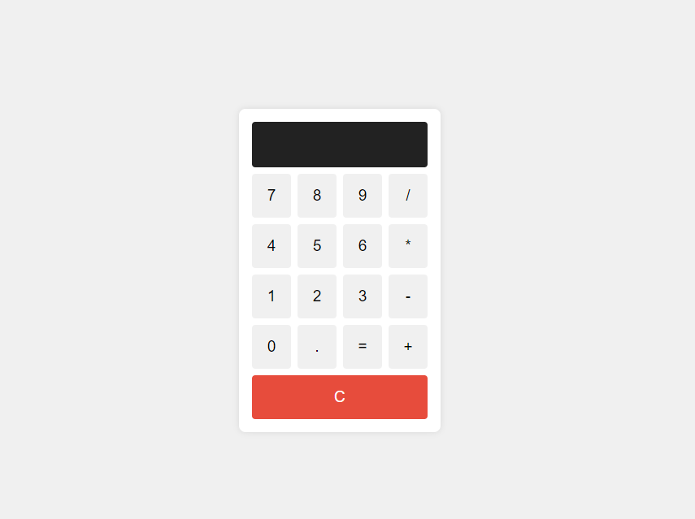

# Calculator
<h4>Overview</h4> 
This project is a simple yet functional web-based calculator built using HTML, CSS, and JavaScript. The calculator allows users to perform basic arithmetic operations such as addition, subtraction, multiplication, and division. It features a clean and intuitive user interface, making it easy for users of all ages to perform calculations quickly and efficiently.
 <h4>Features</h4> <ul> <li><strong>User-Friendly Interface:</strong> The calculator has a clear display and well-organized buttons, ensuring a smooth user experience.</li> <li><strong>Basic Arithmetic Operations:</strong> Supports addition (+), subtraction (-), multiplication (*), and division (/).</li> <li><strong>Clear Function:</strong> Includes a "C" button to clear the display and reset the calculator.</li> <li><strong>Responsive Design:</strong> The calculator is styled to be visually appealing and accessible on various devices, from desktops to mobile phones.</li> <li><strong>Error Handling:</strong> The calculator can handle basic input errors and displays an error message when an invalid operation is performed.</li> </ul> <h4>Technical Details</h4> <ul> <li><strong>HTML:</strong> Provides the structure for the calculator, including the display area and the buttons.</li> <li><strong>CSS:</strong> Adds styles to make the calculator look visually appealing, with a modern and clean design.</li> <li><strong>JavaScript:</strong> Implements the functionality of the calculator, handling user inputs, performing calculations, and updating the display accordingly.</li> </ul> <h4>Usage</h4> <ol> <li><strong>Loading the Calculator:</strong> Open the <code>index.html</code> file in any web browser to load the calculator.</li> <li><strong>Performing Calculations:</strong> <ul> <li>Click on the number buttons (0-9) to input numbers.</li> <li>Click on the operator buttons (+, -, *, /) to choose an operation.</li> <li>Click on the "=" button to perform the calculation and display the result.</li> <li>Click on the "C" button to clear the display and start a new calculation.</li> </ul> </li> <li><strong>Error Handling:</strong> If an invalid operation is attempted (e.g., dividing by zero), the display will show "Error". Press "C" to clear the error and continue using the calculator.</li> </ol> <h4>Code Explanation</h4> <ul> <li><strong>HTML:</strong> Defines the main structure with a <code>div</code> for the display and multiple <code>button</code> elements for user inputs.</li> <li><strong>CSS:</strong> Styles the calculator, ensuring a responsive layout and interactive button states.</li> <li><strong>JavaScript:</strong> Adds event listeners to buttons, handles arithmetic operations using the <code>eval()</code> function, and manages display updates and error handling.</li> </ul> 
This project demonstrates a practical application of web development skills, integrating HTML, CSS, and JavaScript to create a functional and user-friendly calculator.
 </body> </html>

<!-- LICENSE -->
## License

Distributed under the MIT License. Click [https://github.com/krsakshi/Calculator/blob/main/LICENSE.md] for more information.
